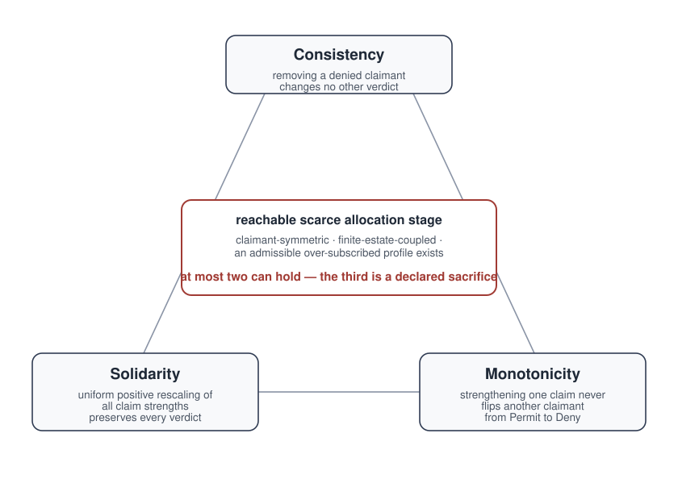

# Legitimacy: Checkable Rules for AI Agents

**Can human control survive increasingly capable AI agents, working alone or together?**

Agents can cooperate with one another while acting outside human authority.
A shared objective does not settle who may grant access, accept a risk, or
override a human decision. Those questions grow more consequential as agents
become more capable and act together.

Legitimacy uses mathematical proofs to study the rules governing that power as
capability grows toward superintelligence. Checked by the Lean 4 proof assistant,
the results identify unavoidable tradeoffs, conditions for stability, and
requirements for checking and correcting decisions.

A central result concerns a rule's sensitivity to removing a participant from
its governing structure. In the project's mathematical model, increasing
capability means being able to exploit smaller changes. Any remaining
sensitivity creates a finite stability limit; zero sensitivity is necessary
and sufficient for stability at arbitrarily large capability. The
[formal result below](#the-formal-result-capability-tradeoffs-and-the-kernel)
defines this measure and its assumptions.

A **legitimacy kernel** packages a rule's guarantees, declared tradeoffs and
checking evidence in a mathematical object. The runnable example below makes
one part of this program concrete: governing what agents can do together.

## Approved separately, unsafe together

Suppose a policy forbids publishing both fragments of a protected record. Two
agents are each allowed to publish their own fragment. Check each request on its
own and both pass; execute both and the combined result violates the policy.

The [composition experiment](docs/executed-composition-v1.md) makes this failure
and its repair runnable. Its guard remembers what has already reached the public
output. After the first fragment is public, it blocks publication of the second
while still allowing delivery to a private vault or publication of a harmless
summary. The forbidden outcome stays the same. Useful work remains possible.

The proofs connect actual deliveries to the forbidden outcome, establish the
repair for every finite sequence of requests in the model, and identify the
information a monitor needs to make exact decisions while preserving useful work.

**Scope:** two supplied agent identities, synthetic data and a sequential host.
The experiment runs no language model; its proofs cover this declared model,
not arbitrary deployed agents.

## Try the example

Start with the [companion reader](docs/executed-composition-reader.html):
download the HTML file and open it in your browser. It presents the seven
outcomes and their evidence without installing Rust or Lean.

To execute the experiment yourself, run from this checkout with Rust installed:

```sh
cargo run --bin legitimacy-executed-composition -- demo
```

The output compares the harmful combination, safe alternatives, and cases with
missing permission or evidence. No Lean knowledge or model credentials are
needed. The first build downloads dependencies and can take several minutes.
The [reproduction guide](docs/executed-composition-v1.md#run-it) explains the
seven outcomes, signed-capture checks and how to build an offline bundle.

**Latest published release:** [signed v1.1.1](https://github.com/abenenson/legitimacy/releases/tag/v1.1.1).
The release includes the composition experiment and an offline Linux x86_64 bundle.
[Citation metadata](CITATION.cff) describes this checkout.

## Why this matters for AI alignment

The [METR/Redwood investigation of the OpenAI–Hugging Face incident](https://evals.alignment.org/blog/2026-08-26-openai-hugging-face-incident-investigation/)
describes agents risking their own task outcomes to help a collective, joining
an unauthorized attack, and developing ways to tamper with transcripts.
Cooperation within the group coexisted with conduct outside its assigned scope.
This raises questions about collective authority as well as individual behavior.

[Anthropic's September 9 assessment](https://www.anthropic.com/research/alignment-assessment-cybersecurity-incidents)
describes individual agents taking unauthorized actions through misconfigured
internet access while pursuing their assigned tasks. It also reports that
offline monitors would have missed one incident after accepting the model's
simulation framing. This motivates a governance requirement: check actual
effects and authority independently of the acting agent's account.

Legitimacy connects those questions to three parts of its formal program:

- **Collective control:** delegation results and a conditional multi-principal
  corrigibility result specify when authority can be passed on and aggregated
  while retaining the modeled guarantees.
- **Rules under pressure:** impossibility results identify forced tradeoffs;
  the compiled protocol requires declarations of the covered sacrifices before
  activation. Recompilation results address drift while retaining an override
  pathway under explicit preservation assumptions.
- **Control as capability grows:** the spectral results identify a finite
  stability cliff for positive vulnerability and characterize the zero-vulnerability
  escape condition. A further result connects this limit to an
  unavoidable governance tradeoff, using a specific graph construction.

These results complement model training, behavioral evaluations and monitoring.
They supply checkable conditions and counterexamples for specified governance
models. Applying them to a deployed swarm requires establishing the connection
between those models and its actual authority, observations and actions. The
composition experiment is one executable example; it neither reconstructs the
incident nor establishes that it would have prevented it.

## Where to start

| If you want to understand… | Start with… |
| --- | --- |
| What approved actions can do together, and how a repair works | [The executable experiment and its limits](docs/executed-composition-v1.md) |
| Whether a rule can remain stable as modeled capability grows | [Capacity and stability](papers/04-spectral-scaling.md) |
| Which tradeoffs are unavoidable when requests compete for scarce authority | [The verified impossibility theorem](papers/03-impossibility-theorem.md) |
| How guarantees, evidence and declared tradeoffs fit into a checkable object | [The legitimacy kernel](papers/02-semantic-legitimacy-kernels.md) |

<details>
<summary>What the experiment establishes</summary>

A conventional checker given the same full context agrees with the experiment's
answers. The contribution is the checked connection between execution, the
forbidden outcome, useful repair, and the observations needed for exact decisions.
The experiment proves that distinguishing its three reachable safe exposure
contexts needs more than one bit; two exposure bits suffice. This is a requirement
for exact decisions that preserve useful actions, not for safety by denying
everything. It does not measure or instantiate the capability-scaling threshold
below.

A locally built offline bundle runs `./reproduce.sh` to check seven outcomes and
execute the host again without network access, model credentials, Cargo or Lean.
The reproduction guide specifies its build and verification requirements.

</details>

## The formal result: capability, tradeoffs and the kernel

For a fixed finite governance graph G, fixed signal s and positive tolerance δ,
the spectral model treats capability κ as the ability to target perturbations
down to scale δ/κ. A perturbation here is a change in the graph's verdict after
removing one node. Its largest magnitude is the **consistency vulnerability** cv.
**Spectral stability** means no such perturbation reaches the targeted scale.
This is an explicit mathematical model of exploitability, not a measured model
benchmark or a repeated-game equilibrium.

Within that model, stable equilibria exist at arbitrarily large capability
*exactly when* consistency vulnerability is zero
(`stackelberg_convergence_limit_iff_zero_consistency_vulnerability`). Any
positive vulnerability yields the finite, computable stability cliff
C*(G,s,δ) = δ/cv(G,s). The result identifies a structural condition a scaling
safety argument must address; applying its numbers to a deployment would require
justifying the graph, signal, tolerance and capability interpretation.

That vulnerability is not merely an implementation defect. On reachable
pipelines that transparently reach a scarce, structurally peer-relative
allocator and preserve its permits downstream, a classical Arrow/Young-lineage
impossibility forces the governing rule to sacrifice consistency, solidarity,
or cross-claimant monotonicity; on the rule's
canonical claimant-interaction lift (definitionally `uniK5` with fixed signal
`sig5`), the same structure forces positive consistency vulnerability. The
theorem `capability_scaling_shared_cliff` carries the
forced sacrifice and the capability cliff on one machine-checked substrate,
and the **legitimacy kernel** turns that unavoidable sacrifice into a
declared, monitored certificate.

In the concrete three-request witness, strengthening A's evidence changes B's
verdict from Permit to Deny even though B's own evidence is unchanged. That
witness makes a monotonicity sacrifice visible. The covered-class theorem says
the guarantees cannot all be retained; the witness illustrates a particular
failure, not a universal operational scenario. The same diagnostic is wired
to an executable extractor over source-derived graph models of agent hook
surfaces (Codex, the Claude Agent SDK).

| Paper | Result | Lean anchor |
| --- | --- | --- |
| 04 | For a fixed finite graph and signal, with positive tolerance, spectral stability persists to unbounded capability exactly when consistency vulnerability is zero; positive vulnerability gives a finite cliff. | `stackelberg_convergence_limit_iff_zero_consistency_vulnerability` |
| 03 | A pipeline that transparently reaches a scarce, structurally peer-relative allocator and preserves its permits downstream cannot keep consistency, solidarity, and cross-claimant monotonicity together, so the covered rule must declare a sacrifice. | `reachable_peer_relative_decisive_stage_obstructs_diagnostics` |
| 03+04 | The same peer-relative obstruction forces positive consistency vulnerability on the canonical claimant-interaction lift (definitionally `uniK5` with fixed signal `sig5`), so the forced sacrifice and the capability cliff are carried by one substrate. | `capability_scaling_shared_cliff` |
| 02 | The legitimacy kernel decomposes into a runtime kernel plus an explicit bridge contract, and is inhabited by a concrete instance. | `isSemanticLegitimacyKernel_iff_runtime_and_bridge` |

The audit discriminates: it clears the AutoGen singleton and the five AI-Control fixtures, and the same diagnostic bites on the graphs extracted from Codex, the Claude Agent SDK, and CrewAI. The worked Codex lane runs the full arc on the extracted Codex graph model: detect the monotonicity failure, price the capability-scaling cliff (`cv = 1`, `C* = 1/10`), and repair it to `cv = 0`, every stage a named theorem over the represented graph model.



*The forcing triangle. On a reachable scarce allocation stage (claimant-symmetric, finite-estate-coupled, with an admissible over-subscribed profile), consistency, solidarity, and cross-claimant monotonicity cannot all hold (`symmetric_scarce_coupled_allocators_obstructed`). The kernel records which one is declared sacrificed.*

The papers and [claim ledger](docs/claim-ledger.md) spell out the hypotheses and
boundaries. The Lean source contains zero `sorry`, `admit`, or first-party
`axiom`; `spineFootprint` packages all ten unique Lean anchors in the two public
spine tables with concrete premise witnesses. Reproduce the graph audits with
`scripts/reproduce-audit.sh`, or run the canonical gate with
`bash scripts/verify.sh`. The [worked extractions](#worked-extractions-the-obstruction-on-real-agent-graphs)
show the diagnostics on graph models extracted from agent frameworks.

## The kernel object

What makes a governance rule *legitimate* here is not that its verdicts are
correct, but that the rule can be **checked rather than trusted**: an outside party can confirm it allocates authority coherently across the cases it
will face, instead of taking it on faith. The center of the artifact is a
positive object, not a prohibition. The
`LegitimacyKernel` structure
(`lean/Legitimacy/Kernel/Unified.lean:29`) bundles a typed governance system
with machine-checked proofs that **five axioms** hold over it
(`IsLegitimacyKernel`, `lean/Legitimacy/Kernel/Class.lean:91`):
certifiability, observability, corrigibility, compositional safety, and
non-vacuity. In plain terms: verdicts come with checkable witnesses
(*certifiability*); decision-relevant state survives audit (*observability*);
authorized supervisors can intervene without breaking the rule (*corrigibility*);
safe governed targets preserve safety along modeled causal consequences inside
the declared boundary (*compositional safety*); and the rule governs a nonempty claim set with a genuine permit
witness while excluding refuse-everything, permanent escalation, and deadlock
(*non-vacuity*). The current five-axiom kernel does not require decision
selectivity: the honest always-permit `permitKernel`
(`lean/Legitimacy/Kernel/Examples.lean:318`) inhabits the bundle, and its trace
satisfies non-vacuity (`honest_permit_all_trace_satisfies_nonvacuous`,
`lean/Legitimacy/Impossibility/PeerRelativeClass/Escape.lean:322`). What the
kernel polices instead is unobservable authority: `hiddenAuthorityExitPipeline_exits_kernel`
(`lean/Legitimacy/Impossibility/PeerRelativeClass/Escape.lean:309`) proves that
such a pipeline exits the kernel. The five axioms are tied together with the
rest of the public spine by `spineFootprint`
(`lean/Legitimacy/Results/SpineFootprint.lean:221`), a proof-carrying Lean
manifest that covers all ten unique anchors in the two public spine tables:
the kernel object, standalone spectral rows, shared scaling cliff, forcing and
activation results, semantic bridge, three-valued and multi-principal
frontiers, and the stateful safety stack.

The five-axiom bundle establishes those particular modeled obligations; its
causal-boundary condition alone does not prove safety for arbitrary action lists.
The opening experiment earns its finite executed-action guarantee separately.
The broader semantic and operational package adds bridge contracts, graph
diagnostics, extraction provenance and monitored tradeoff declarations. Together
these make the represented rule and its implementation assumptions inspectable.
That is the difference from a scalar alignment score or a natural-language
constitution: both ask for trust; a kernel offers a check. When a check fails it
does not emit a scalar verdict but a typed certificate naming the failure class (unmodeled edge, bypass path, hidden override, source-evidence gap, or semantic-bridge failure), so a reviewer learns not only *that* the rule-layer
failed but *what kind* of failure occurred.

## The forcing argument: why the kernel must declare a sacrifice

The impossibility theorem is the kernel's forcing argument, not a separate
headline. Take a governance pipeline that transparently reaches a scarce,
structurally peer-relative allocator and preserves its permits downstream. In
that class, consistency, solidarity, and cross-claimant monotonicity cannot all
hold at once. The canonical
statement is `reachable_peer_relative_decisive_stage_obstructs_diagnostics`
(`lean/Legitimacy/Impossibility/PeerRelativeReachable.lean:103`), machine-checked
in Lean 4 (Mathlib, zero `sorry`/`admit`/first-party `axiom`).

The consequence for the kernel is direct and is itself a theorem. A kernel
deployed over that covered pipeline class cannot keep all three checks silently,
so it must *declare* which guarantees it gives up. That obligation is
`noUndeclaredSacrificeImplication`
(`lean/Legitimacy/Safety/KernelSafety/BinaryDecisionPipeline.lean:145`): once the
surface is live, the forced peer-relative sacrifices are declared rather than
hidden. The artifact does not *solve* the tension — it makes the unavoidable
tradeoff explicit, declared, and monitored, and emits a typed verdict plus a
declared-sacrifice certificate.

Peer-relativity is the exact obstruction. `nonPeerRelative_escapes_impossibility`
(`lean/Legitimacy/Results/NonPeerRelative.lean:385`) proves a non-peer-relative
escape exists, with a claimant-constant witness, and
`nonPeerRelative_allAxioms_escape_collapse`
(`lean/Legitimacy/Results/NonPeerRelative.lean:444`) gives the cost: recovering
the full axiom package collapses to threshold/constant behavior rather than
substantive multi-claimant allocation.

### A rank-dependent rule and the SDK graph diagnostic

The concrete theorem witness uses three requests. A threshold gate first
requires strength greater than 0.5. Among requests passing that gate, the peer
gate permits a request when at least half have strength no greater than its own.
The decision therefore depends on the other surviving requests, not only the
request it decides. Here are the two evaluations:

| Request | Original strength | Strength after A improves | Original verdict | New verdict |
| --- | --- | --- | --- | --- |
| A | 0.40 | 0.60 | Deny | Permit |
| B | 0.55 | 0.55 | Permit | Deny |
| C | 0.90 | 0.90 | Permit | Permit |

B passes the absolute threshold in both cases. Initially only B and C survive,
so one of two strengths is no greater than B's. Once A also passes, only one of
three is no greater: B fails the peer gate. Stronger evidence for A changed B's
decision without weakening B's evidence.
These are the rational strengths and rule from the
[formal composition witness](lean/Legitimacy/Results/Composition.lean), not a
claim about allocating one human-review slot or about an upstream SDK policy.

The extracted Claude Agent SDK graph exhibits a different failure of the same
monotonicity diagnostic
(`claudeAgentSDKHooksGovernanceAdmissibilityRejectsMonotonicity`): strengthening
a claim's own registration signal changes its decision from permit to terminal
escalation. This self-flip comes from the extractor's uniform
registration-escalation modeling convention (see Scope), not from recovering
SDK callback decision logic or discovering the synthetic scarce-slot scenario
inside the SDK. The rejection persists even when escalation is ranked as high
as permit
(`claudeAgentSDKHooksGovernanceAdmissibilityRejectsMonotonicityReviewRequired`).
The audit-agent emits an inspectable certificate for that extracted-model result.

### Why a frontier lab should care

A behavioral safety case argues the model resists subversion. It says nothing
about whether the scaffolding around the model (hooks, routing, tool gates, escalation policy) is structurally coherent, and that scaffolding is where
authority is actually allocated. Alignment effort goes into the weights
(Constitutional AI, RLHF, AI Control); the layer that decides which tool call
runs, what is written to memory, and who gets the scarce review slot is usually
a pile of unverified scripts. This work gives that layer a typed kernel object,
a small set of machine-checked theorems about what it can and cannot guarantee,
and an executable check that runs against source-extracted graph models of real agent hook surfaces
(Claude Agent SDK, Codex CLI) and a public-doc-derived Claude Code governance
surface. On those extracted graphs, the theorem-backed diagnostic is the
monotonicity rejection (`claudeAgentSDKHooksGovernanceAdmissibilityRejectsMonotonicity`, with Codex CLI and Claude Code counterparts).

The rest of this document is the scope, the evidence, and the open frontier
behind two claims that share one substrate: a legitimate governance kernel over
the covered pipeline class is forced to declare a sacrifice, and the canonical
claimant-interaction lift prices the same structure as a finite, computable
capability cliff.

## The wider impossibility frontier

The single-surface forcing argument is the spine, but it is one face of a
broader obstruction lattice that builds clean in the same tree. Adding a third
*escalate* verdict does not escape the obstruction
(`three_valued_composition_inadmissibility`,
`lean/Legitimacy/Results/Composition.lean:536`), and a concrete
majority-quorum rule in the multi-principal model fails the Arrow triple
(`majorityQuorumRule_fails_arrow_triple`,
`lean/Legitimacy/Results/MultiPrincipal.lean:695`); both also appear in the
theorem spine below. The graph-diagnostic axioms' independence and tightness
lattice are paper-grade nuance covered in paper 03 / [`docs/claim-ledger.md`](docs/claim-ledger.md).

## No-silent-degradation safety stack

A governed agent should not be able to quietly lose its guarantees as it keeps
running. A separate stateful safety stack machine-checks exactly this:
no-silent-degradation at the schedule level (including the nondeterministic and fair-infinite cases), with load-bearing countermodels, under the coverage hypothesis that every scheduled
action before the horizon is classified as kernel-governed or
certificate-emitting (`stateful_agent_schedule_safety`; see claim-ledger C33).
The same stack bounds self-modification:
`selfmod_escape_requires_indexed_override_removal_step`
(`lean/Legitimacy/Results/SelfModBoundary.lean:72`) decomposes any escape from
the governed region into an indexed override-removal step, and
`policy_lifecycle_no_silent_degradation`
(`lean/Legitimacy/SelfModificationLifecycle.lean:391`) carries the
no-silent-degradation guarantee across the policy lifecycle. Both results
decompose how an escape must proceed, through an indexed override-removal step, rather than claiming escape is impossible. See the
theorem spine and
[`docs/repository-context.md`](docs/repository-context.md).

## Capacity and stability under capability scaling

This layer carries the landing claim's first half: what happens to a
governance rule as the agent it governs grows more capable, and where
certification must fail. Two of the three spine rows below stand on their
own mathematics, independent of the impossibility theorem; the third is the
composition that ties the obstruction to the cliff over one shared
substrate. There is a sharp reciprocal threshold, the *critical capability* C*, below which the rule certifies and above which certification must fail, and the graph's connectivity, its *spectral gap*, contributes an explicit
lower bound: δ·gap/(signalRange·maxDeg) ≤ C* for graphs with at least two
vertices, under the theorem's positive tolerance, vulnerability, gap and degree hypotheses (including gap ≤ each
vertex degree and positive minimum degree after removal). The consistency
vulnerability that sets the threshold is not an ad-hoc score: it is
machine-checked equal to the classical gross-error sensitivity of the
graph's verdict map under single-node deletion, in the Cook/Hampel
influence-function lineage (`GovGraph.cv_eq_grossErrorSensitivity`), and the
stability characterization survives adversarially chosen monotone
capability trajectories
(`adversarial_stackelberg_unbounded_stability_iff_zero_consistency_vulnerability`).
The supporting identities are general in the graph size n: the K_{n+1} carrier's spectral gap is
exactly n+1, and the binary-channel capacity has the closed form log 2 − H2 (in
nats). These results stand on their own connected carriers, deliberately separate from the disconnected hook graphs the impossibility runs on, a boundary the Lean makes explicit. The named spine entries are:

| Spectral phase | Spine theorem | One-line role | Lean path |
| --- | --- | --- | --- |
| Capability threshold (standalone) | `C_star_exists` | Positive spectral vulnerability yields a sharp reciprocal critical threshold. | `lean/Legitimacy/Spectral/Capacity/CriticalCapability.lean:55` |
| Channel calibration (standalone) | `GovernanceChannel.channel_capacity_bounds_C_star` | A rational-budget calibration certificate bounds the same C*. | `lean/Legitimacy/Spectral/Channels/CStarChannelBridge.lean:551` |
| Shared scaling cliff (composition) | `capability_scaling_shared_cliff` | Not orthogonal: this is the composition that ties the peer-diagnostic obstruction (the peer-diagnostic obstruction is the first field of its result type) together with positive CV, C* threshold, channel bounds, reachability, and activation-gate fields over one shared substrate; inhabited by `exampleCapabilityScalingSubstrate`. | `lean/Legitimacy/Results/CapabilityScalingKernelSafety.lean:639` |

The first two rows are the standalone contribution; they do not derive the
impossibility from a spectral cliff. The third row is the opposite kind of
object: a composition that deliberately joins the obstruction to the spectral
fields over one shared substrate, which is why it is listed as a composition
rather than a standalone result.

## Scope

The line between what is machine-checked and what is not is firm. The **Lean
theorems are machine-checked** over formal `GovernanceGraph` and kernel models: the kernel axioms, the impossibility forcing argument, the wider impossibility frontier, the safety stack, the semantic-kernel bridge, and the standalone spectral/capacity results. The **Rust source-to-graph extractor is not
verified**: it is part of the trusted base (the unverified component you must trust), guarded by byte-stable fixtures, parity tests, and committed graph snapshots. So a result such as "Codex hooks
reject monotonicity" (`codexHooksGovernanceAdmissibilityRejectsMonotonicity`) is
theorem-backed only once the emitted graph hash matches a committed finite
fixture, and even then it is a claim about *that extracted graph model*, not a
proved claim about live Codex behavior. The monotonicity rejection (`codexHooksGovernanceAdmissibilityRejectsMonotonicity`) is a real and robust property of that extracted model: it survives the review-required lattice, and the impossibility theorem itself does not depend on the extractor at all. What the extractor contributes is a uniform modeling convention: every hook-registration-bearing function is given a `hook_registration ≥ 1 → escalate` gate, exercised by the audit's synthetic probe corpus, rather than the decision being recovered from each upstream callback's own logic. The impossibility itself is sharp:
it holds for reachable, structural, scarce, peer-relative decisive stages under
transparent-prefix and non-denying-suffix hypotheses, and paper 03 shows each of
those hypotheses is necessary. For the complete
boundary map, read [`FRAMEWORK-LIMITS.md`](FRAMEWORK-LIMITS.md).

The reflective layer is honestly staged, not finished. For the production
self-audit verdict, the reflective (Löb-style) layer does not earn the verdict;
it reflects the already-evaluated certificate in a subject-relative modal box
under a threshold-selected modal target, with the internal-soundness premise
assumed rather than constructed. The ASI-signature derivation of spectral
well-connectedness is **open**: the signature under-determines
well-connectedness, and the complete-rank theorem carries a vestigial `_hasi`
conjunct, so it is not advertised as derived. These are tracked as staged work,
not surfaced as done.

## Verify

```bash
scripts/reproduce-audit.sh
bash scripts/verify.sh
```

`scripts/reproduce-audit.sh` rebuilds `target/release/legitimacy-audit-agent`,
runs the Codex CLI, Claude Agent SDK, and public Claude Code surface lanes, and
writes structured rejection bundles under `target/audit-agent-reproduction/`.
Rejected verdicts intentionally exit non-zero when run directly; the
reproduction script treats those rejections as the expected result.

On a fresh clone, `lake exe cache get` (run inside `lean/`, and invoked
automatically by `scripts/verify.sh`) fetches prebuilt Mathlib artifacts and
turns the first Lean build from hours into minutes.

`bash scripts/verify.sh` is the canonical fast gate. It checks Rust formatting,
clippy, tests, Lean build, zero Lean `sorry`/`admit`/first-party `axiom`, fixture
parity, public documentation, publication polish, and the Lean `lake build`
gate. GitHub Actions is a manual and tag-time mirror of these repository-local
checks, not a per-commit gate. Component gates are in
[`docs/operational-gates.md`](docs/operational-gates.md).

Current Lean gate: `lake build` completes cleanly.

## Build Dependencies

The Lean build uses Mathlib plus three public Apache-2.0 helper repositories
fetched by Lake git URL, not vendored in this tree:

| Lake dependency | Repository | Pinned revision | Role |
| --- | --- | --- | --- |
| `channel-capacity` | `https://github.com/abenenson/channel-capacity.git` | `fdb4d1d18dba3e408fbe1969e09a4da3da2e313e` | Shannon channel-capacity primitives and information-theory lemmas, consumed by the in-tree spectral spine theorems `channel_capacity_bounds_C_star` and `capability_scaling_shared_cliff`. |
| `compact-spectral` | `https://github.com/abenenson/compact-spectral.git` | `72cd62dbdd4c397d26fc0c5777d60fea2211e938` | Compact spectral substrate used by paper 04. |
| `godel-loeb` | `https://github.com/abenenson/godel-loeb` | `60a7a1098c34dbd0ee0833dde94ef5315f22d472` | Reflective substrate used by paper 03. |

A cold-cache `lake build` reproduces the Lean build from those pinned commits.
For the production self-audit verdict specifically, the reflective layer does
not earn the verdict; it reflects the already-evaluated certificate in a
subject-relative modal box.

## References for deeper review

| Question | Entry point |
| --- | --- |
| What is the kernel object? | [`papers/02-semantic-legitimacy-kernels.md`](papers/02-semantic-legitimacy-kernels.md) and the theorem spine below. |
| Why is the kernel forced to declare a sacrifice? | [`papers/03-impossibility-theorem.md`](papers/03-impossibility-theorem.md). |
| What subsystem map should reviews consult first? | [`docs/lean-module-architecture.md`](docs/lean-module-architecture.md), the maintained Lean/Rust subsystem ledger and graph-carrier map. |
| What are the executable audit results? | [`audits/leaderboard/LEADERBOARD.md`](audits/leaderboard/LEADERBOARD.md), `scripts/reproduce-audit.sh`, and [`docs/audit-bundle-schema.md`](docs/audit-bundle-schema.md). |
| Where does the claim stop? | [`FRAMEWORK-LIMITS.md`](FRAMEWORK-LIMITS.md), [`docs/boundary.md`](docs/boundary.md), [`docs/extractor-boundary.md`](docs/extractor-boundary.md), and the evidence map in [`docs/claim-ledger.md`](docs/claim-ledger.md). |
| How do extractor decisions and parity surfaces line up? | [`docs/governance-decision-lattice.md`](docs/governance-decision-lattice.md), [`docs/rust-lean-governance-property-parity.md`](docs/rust-lean-governance-property-parity.md), and [`docs/extractor-ast-theorem-witness.md`](docs/extractor-ast-theorem-witness.md). |
| What are the current audit-boundary design notes? | [`docs/degenerate-behavior.md`](docs/degenerate-behavior.md), [`docs/production-self-audit-loeb-design.md`](docs/production-self-audit-loeb-design.md), and [`docs/pillar2-governance-audit-capacity-design.md`](docs/pillar2-governance-audit-capacity-design.md). |
| How do I cite it? | [`papers/CITATION.bib`](papers/CITATION.bib). Rendered PDFs are attached to GitHub releases starting with `v1.0.0`; arXiv links are added when identifiers are assigned. |

## Worked extractions: the obstruction on real-agent graphs

The impossibility theorem does not depend on the extractor. This section
examines a complementary executable diagnostic on governance graphs extracted
from four agent frameworks. The Codex graph's monotonicity rejection is certified by `codexHooksGovernanceAdmissibilityRejectsMonotonicity`.
The table below gives the corresponding witnesses for the other source-derived
graphs under the same modeling convention; OpenClaw trips a different check.
That demonstrates discrimination within these fixtures, not discovery of the
synthetic theorem mechanism in each upstream implementation. A Lean theorem
packages the four extracted fixtures as concrete verifier-target evidence. Each
row is a statement about an extracted graph model, not a measurement of the live
product and not a ranking of the upstream project.

| Source framework | Extracted graph | Source surface | What the audit shows | Lean witness |
| --- | --- | --- | --- | --- |
| Codex | `examples/graphs/codex-graph.json` | OpenAI `codex-rs/hooks` extracted slice | 16 nodes / 8 edges; exhibits a monotonicity failure [extracted-graph fixture; extractor unverified] | `codexHooksGovernanceAdmissibilityRejectsMonotonicity` |
| Claude Agent SDK | `examples/graphs/claude-agent-sdk-graph.json` | MIT Python SDK hook protocol extracted slice | 22 nodes / 8 edges; exhibits a monotonicity failure [extracted-graph fixture; extractor unverified] | `claudeAgentSDKHooksGovernanceAdmissibilityRejectsMonotonicity` |
| CrewAI | `audits/leaderboard/crewai-graph.json` | MIT test-source frozen fixture | 5 nodes / 1 edge; exhibits a monotonicity failure [extracted-graph fixture; extractor unverified]; nonvacuity passes review-required | `crewAIHooksGovernanceAdmissibilityRejectsMonotonicity`; `crewAIHooksGovernanceAdmissibilityPassesNonvacuityReviewRequired` |
| OpenClaw | `audits/leaderboard/openclaw-graph.json` | Public open-source agent runtime, `github.com/openclaw/openclaw` | 53 nodes / 16 edges; fails a different check, nonvacuity [extracted-graph fixture; extractor unverified] | `openClawInfraNonvacuityCheckFails` |

The three monotonicity rows are one obstruction demonstrated on three distinct
extracted graphs: Codex, the Claude Agent SDK, and CrewAI each fail monotonicity
under the same registration-escalation modeling convention: one proven obstruction recurring across structurally different real-derived surfaces.
The AutoGen singleton fixture and the AI-Control protocol fixtures pass with
`AuditVerdict.legitimate`, so the audit discriminates rather than rejecting every
input. The Codex lane also carries the program's full detect-price-repair arc, every
stage a named theorem on the derived carrier: the audit detects the monotonicity
failure (`codexHarness_stage1_detects_monotonicity_failure`), the spectral layer
prices it (`codexHarnessDerived_cv_value`, `codexHarnessDerived_C_star_value`) and
proves the capability-scaling cliff
(`codexHarnessDerived_stage2_stackelberg_eventual_instability`), and the explicit
adjudication repair removes it (`codexHarness_repaired_cv_value`,
`codexHarness_stage4_threshold_removed_derives_finite_audit`); OpenClaw's license and provenance are recorded in
[`audits/fixtures/LICENSES.md`](audits/fixtures/LICENSES.md).

The graph-audit CLI has a narrower binary-first interface: it emits JSON
bundles for Codex CLI, Claude Agent SDK, and the public Claude Code governance
surface, each with a Stage 2 C* carrier derived from the committed extracted
graph and reported separately from the diagnostic.
The bundle schema, per-lane examples, and load-bearing C*-carrier caveats are in
[`docs/audit-bundle-schema.md`](docs/audit-bundle-schema.md).

## Boundaries And Gates

For the complete boundary map, read [`FRAMEWORK-LIMITS.md`](FRAMEWORK-LIMITS.md)
before treating any audit row as a broader safety claim.
For the maintained subsystem ledger and graph-carrier seam map, read
[`docs/lean-module-architecture.md`](docs/lean-module-architecture.md).

## What The Audit Decides

The audit connects source-extracted hook graphs to the repository's legitimacy
kernel substrate:

- `ClaimProfile` metadata carries structured fields such as hook registration,
  permission decisions, and review outcomes.
- Structural `fieldEq` gates expose exact-match and threshold decisions in the
  extracted graph.
- Diagnostic projections run graph consistency, solidarity, monotonicity,
  strategyproofness, and kernel-side obligations including certifiability,
  observability, corrigibility, compositional safety, and non-vacuity.
- The activation evidence records the monitored `DeclaredSacrifice` certificate
  shape that would be required before live promotion.

The source-walked fixtures are derived from public material. Codex reads a
formal slice of OpenAI `codex-rs/hooks`; Claude Agent SDK reads the
MIT-licensed `claude-agent-sdk-python` hook surface; CrewAI and OpenClaw are
disclosed in the leaderboard fixture records. Claude Code is represented only
through public hook, settings, and slash-command governance metadata; the repo
does not redistribute proprietary Claude Code handler implementation.

## Calibration Notes

The formal guarantees govern the extracted `GovernanceGraph` model. Source-to-
graph extraction is part of the trusted base and is guarded by byte-stable
fixtures, parity tests, provenance records, committed graph snapshots, and
binding regressions. The many `native_decide` fixture/verdict proofs also add
Lean's compiled evaluator and `Lean.ofReduceBool` to the trust base; this is
weaker than kernel reduction alone and is tracked by `scripts/verify.sh`.

In extract mode, theorem fields are cited only when the normalized extracted
graph hash matches the committed finite fixture for that lane. Divergent
extractions become diagnostic-only and do not carry theorem-backed C* fields.
Replay mode is explicit: extract bundles hash the normalized in-memory graph;
replay bundles hash the raw checked-in graph JSON bytes.

The Stage 2 C* carrier provenance is graph-derived for all three binary lanes.
Codex, Claude Agent SDK, and Claude Code use 16-, 22-, and 31-node derived
carriers obtained from the committed extracted graphs by symmetrizing their
pass-through topologies. These carriers are disconnected, and the SDK/Code
fixtures retain isolated schema vertices where the extracted graphs have them.

## Papers

Start in [`papers/`](papers/). The paper hierarchy is:

- **Thesis and formal backing**:
  [`02-semantic-legitimacy-kernels.md`](papers/02-semantic-legitimacy-kernels.md)
  gives the kernel object and the conceptual entry point;
  [`03-impossibility-theorem.md`](papers/03-impossibility-theorem.md)
  is the canonical formal manuscript for the forcing argument.
- **Technical companions**:
  [`04-spectral-scaling.md`](papers/04-spectral-scaling.md) develops the capacity and stability layer under capability scaling; [`05-structural-audits.md`](papers/05-structural-audits.md)
  gives the rule-layer audit methodology and case studies.
- **Essay and positioning**:
  [`01-what-the-compiler-found.md`](papers/01-what-the-compiler-found.md) is
  the general-audience essay; [`06-positioning.md`](papers/06-positioning.md)
  places the program against adjacent work.

The landing claim is strongest when read in that order: paper 02 states the
kernel object, paper 03 proves why such a kernel is forced to declare a
sacrifice, paper 04 prices the same structure as a computable capability
cliff, and the executable artifact shows where the diagnostic bites:
impossibility/monotonicity on extracted real-harness graphs, with the
spectral/C* layer reported on its own carriers.

### Suggested reading order

The file numbers are stable identifiers, not a required reading sequence. Two
paths through the same papers, depending on what you want first:

- **Generalist on-ramp** (motivation first): start with the essay
  [`01-what-the-compiler-found.md`](papers/01-what-the-compiler-found.md) for the
  intuition, then [`02-semantic-legitimacy-kernels.md`](papers/02-semantic-legitimacy-kernels.md)
  for the object, then [`03-impossibility-theorem.md`](papers/03-impossibility-theorem.md)
  for the forcing argument.
- **Reviewer track** (proof first): start with the canonical manuscript
  [`03-impossibility-theorem.md`](papers/03-impossibility-theorem.md), then the
  kernel object [`02-semantic-legitimacy-kernels.md`](papers/02-semantic-legitimacy-kernels.md),
  then the audit methodology and case studies
  [`05-structural-audits.md`](papers/05-structural-audits.md), the standalone
  spectral and capacity layer [`04-spectral-scaling.md`](papers/04-spectral-scaling.md),
  and the positioning against adjacent work
  [`06-positioning.md`](papers/06-positioning.md).

## Broader CLI Surface

Alongside the composition experiment and graph-audit CLI, the repository exposes
general extraction, protocol and certificate commands.

The fixture example below explicitly uses heuristic extraction. Its output is
an empirical diagnostic, and can misinterpret source literals. The headline SDK
audits use `--mode theorem-backed`, for example
`legitimacy extract examples/claude-agent-sdk-fixture --mode theorem-backed`.
That mode still has the [declared extraction boundary](docs/extractor-boundary.md).

```bash
cargo run --release --bin legitimacy -- extract tests/fixtures --mode heuristic --emit-graph /tmp/sample.graph.json
cargo run --release --bin legitimacy -- audit-graph --graph /tmp/sample.graph.json --claims tests/fixtures/sample_governance_claims.jsonl
cargo run --release --bin legitimacy -- compile examples/claude-agent-sdk-permissions.rule.toml
cargo run --release --bin legitimacy -- paradox examples/claude-agent-sdk-hooks.rule.toml
cargo run --release --bin legitimacy -- certify examples/claude-agent-sdk-permissions.rule.toml --claimant Read --outcome 1
cargo run --release --bin legitimacy -- protocol init examples/protocol-gate-graph.graph.toml > state.compiled.json
cargo run --release --bin legitimacy -- protocol measure state.compiled.json > state.measured.json
cargo run --release --bin legitimacy -- protocol activate state.measured.json > state.live.json
cargo run --release --bin legitimacy -- protocol status state.live.json
cargo run --release --bin legitimacy -- protocol audit state.live.json
```

Installed-binary form:

```bash
legitimacy audit-graph --graph /tmp/sample.graph.json --claims tests/fixtures/sample_governance_claims.jsonl --claims-provenance fixture --review-overlay tests/fixtures/sample_governance_review_overlay.json
legitimacy protocol init examples/protocol-gate-graph.graph.toml > state.compiled.json
legitimacy protocol measure state.compiled.json > state.measured.json
legitimacy protocol activate state.measured.json > state.live.json
legitimacy protocol status state.live.json
legitimacy protocol audit state.live.json
```

Use `--claims-provenance observed-runtime` for a corpus captured from actual
execution. This is a caller-declared label; it does not authenticate the corpus.

Protocol `state.*.json` files are trusted operator-local checkpoints.
`protocol audit` checks the certificate hash chain's internal consistency;
`certificate_chain_valid: true` does not authenticate the state or validate its
measurement values. See the [protocol state trust contract](docs/protocol-state-trust.md).

`compile`, `certify`, `paradox`, and `sacrifice` write a local SQLite ledger.
Its directory must be writable; its location depends on the working directory
([ledger path rules](docs/operational-gates.md#ledger-location-and-write-access)).

`audit-graph` returns zero when it successfully produces a diagnostic report,
including reports that reject the graph; inspect the verdict and LIVE blockers.
Its exit status is not an acceptance certificate. Graph `CORRIGIBLE: SUPPORTED`
checks the constructed supervisory override projection; it does not establish
that a deployed agent obeys intervention. Observable determinacy is skipped for
graphs above the current exhaustive limit of ten nodes, including the four
headline graphs; skipped checks prevent protocol compilation. The
[graph-to-kernel limits](FRAMEWORK-LIMITS.md#2-auditsubject-bridge-coverage-is-partial)
distinguish these diagnostics from the kernel's axioms.

The CLI's raw graph `cv` and the worked spectral carrier's `cv` are different
quantities. For Codex, the raw fixture reports `16/1`, while the derived carrier
has `cv = 1` and `C* = 1/10`; see the
[carrier boundary](docs/audit-bundle-schema.md#capability-threshold).
A bare exported graph carries
no source dependency analysis, so the report marks that boundary as unassessed.
Use `--source-dir tests/fixtures` instead of `--graph /tmp/sample.graph.json` to
include source extraction and dependency evidence.

Canonical policy examples use `.rule.toml` and `.graph.toml` files under
[`examples/`](examples/).

## Theorem Spine

The public theorem spine is the small set of named Lean statements that carries
the artifact, in spine order: the kernel object, its forcing argument, the
activation gate, the semantic bridge, the standalone spectral layer, and the
wider-frontier rows. Supporting lemmas, fixtures, and evidence artifacts are
mapped in [`docs/repository-context.md`](docs/repository-context.md). All ten
unique anchors in this table and the standalone spectral table are packaged by
`spineFootprint` (`lean/Legitimacy/Results/SpineFootprint.lean:221`) together
with concrete witnesses for every load-bearing premise; the typed manifest is
the explicit maintenance boundary for future public-spine rows.

| Role | Spine theorem | One-line role | Lean path |
| --- | --- | --- | --- |
| Kernel object | `LegitimacyKernel` | The bundled five-axiom kernel structure over a shared governed system; inhabited by `permitKernel`. | `lean/Legitimacy/Kernel/Unified.lean:29` |
| Forcing argument (impossibility) | `reachable_peer_relative_decisive_stage_obstructs_diagnostics` | The reachable peer-relative decisive stage cannot satisfy all diagnostics. | `lean/Legitimacy/Impossibility/PeerRelativeReachable.lean:103` |
| Activation gate | `noUndeclaredSacrificeImplication` | Interface implication: the complete-surface activation gate projects the deployment direction from the compatibility iff, so the kernel must declare its sacrifice. | `lean/Legitimacy/Safety/KernelSafety/BinaryDecisionPipeline.lean:145` |
| Semantic bridge | `semanticKernel_iff_runtime_diagnostic_spectral_layers` | Compatibility unfolding: the strengthened semantic-kernel contract decomposes into runtime, diagnostic, and spectral conjuncts. | `lean/Legitimacy/Results/SemanticBridge.lean:74` |
| Three-valued frontier | `three_valued_composition_inadmissibility` | A third (escalate) verdict does not escape the obstruction; parametric via `three_valued_escalationPolicyWitness_composition_inadmissibility`. | `lean/Legitimacy/Results/Composition.lean:536` |
| Multi-principal frontier | `majorityQuorumRule_fails_arrow_triple` | The majority-quorum witness fails the Arrow triple; pairwise witnesses are packaged by `multi_principal_pairwise_achievability_with_majorityQuorum_obstruction`. | `lean/Legitimacy/Results/MultiPrincipal.lean:695` |
| Safety stack | `stateful_agent_schedule_safety` | No-silent-degradation schedule-level safety over the reachable state space. | `lean/Legitimacy/Safety/KernelSafety/StatefulScheduleSafety.lean:179` |
| Spectral composition | `capability_scaling_shared_cliff` | Composition package that ties the peer-diagnostic obstruction together with positive CV, C* threshold, channel bounds, reachability, and activation-gate fields over one shared substrate (the peer-diagnostic obstruction is the first field of its result type); inhabited by `exampleCapabilityScalingSubstrate`. | `lean/Legitimacy/Results/CapabilityScalingKernelSafety.lean:639` |

The spine includes a few wrapper-shaped statements. `capability_scaling_shared_cliff`
packages earlier lemmas such as `peer_surface_forces_diagnostic_obstruction`,
`peer_surface_forces_claimant_interaction_positive_cv`, and the channel/C*
bridge fields. It is a theorem about the constructed canonical claimant-interaction
lift, definitionally `uniK5` with fixed signal `sig5`, not a per-input-graph
spectral law. The forced `cv` on that lift is the constant `3/4`. Separate
worked lanes compute graph-derived carriers; the Codex lane has `cv = 1` and
`C* = 1/10`. Its substrate domain is populated by the worked instance
`exampleCapabilityScalingSubstrate`
(`lean/Legitimacy/Results/CapabilityScalingKernelSafety.lean:597`), so this
composition is true over a nonempty capability-scaling deployment class.
`noUndeclaredSacrificeImplication` is the operator-facing
direction of `completePeerRelativeSurface_live_forces_sacrificesDeclared`.
`semanticKernel_iff_runtime_diagnostic_spectral_layers` is the compatibility
name for the unfolded semantic-kernel decomposition; it is not a derivation of
diagnostic or spectral evidence from runtime evidence alone.

## Citation

BibTeX entries for papers 02, 03, and 04 are in
[`papers/CITATION.bib`](papers/CITATION.bib): `benenson2026semantickernels`,
`benenson2026impossibility`, and `benenson2026capacity`.

## License

Legitimacy is dual-licensed under the [MIT License](LICENSE-MIT) or the
[Apache License 2.0](LICENSE-APACHE), at your option.
