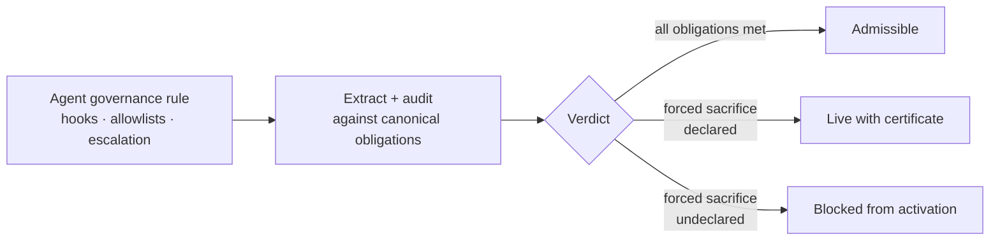
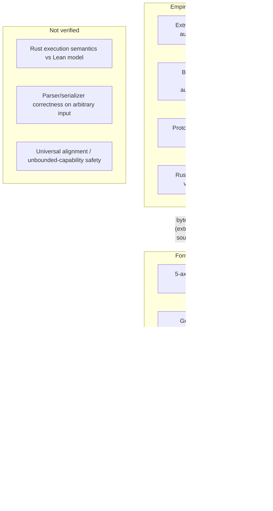
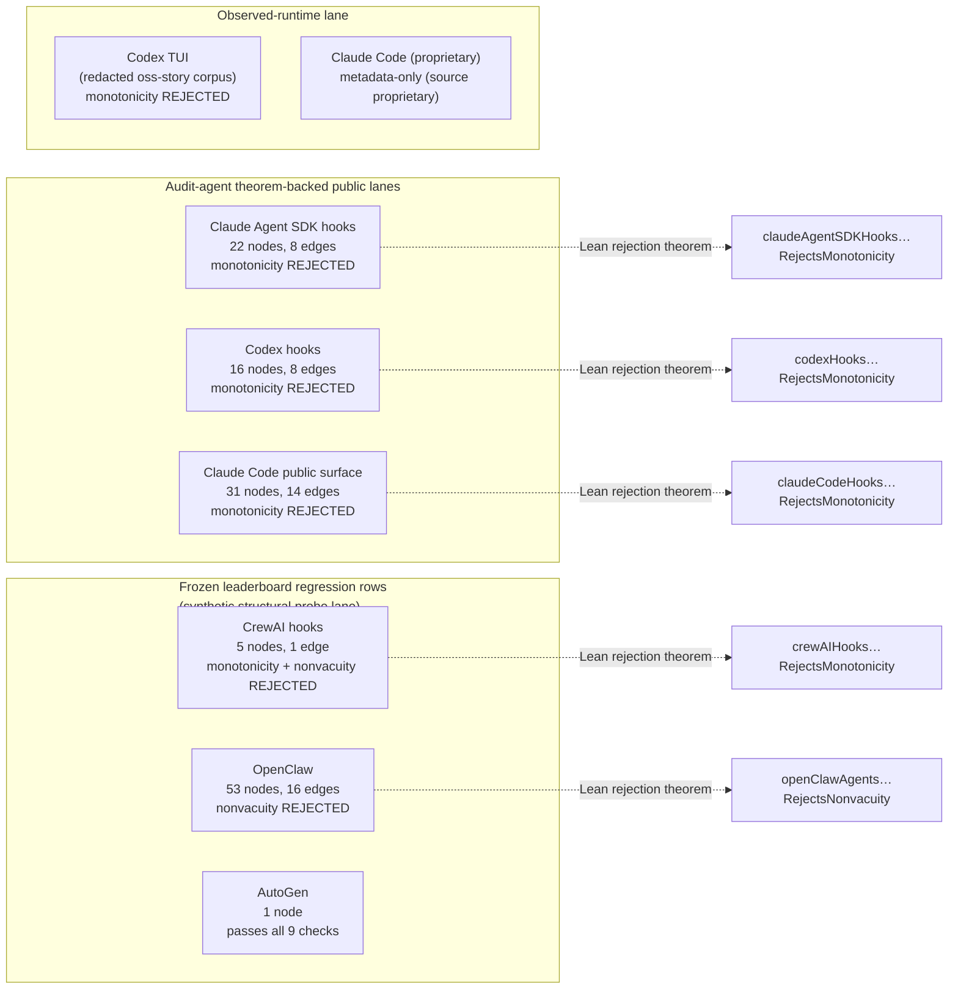
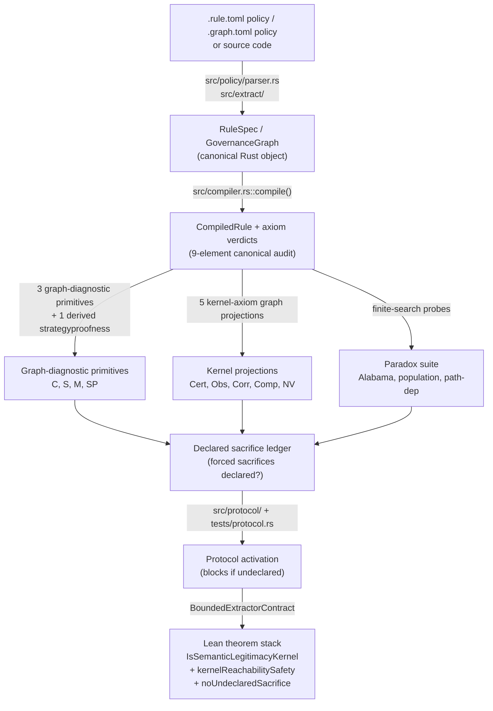
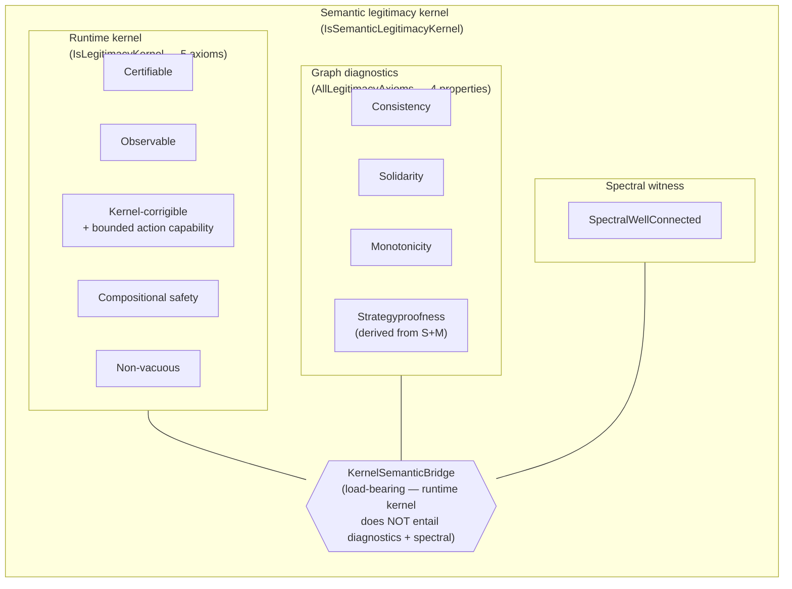
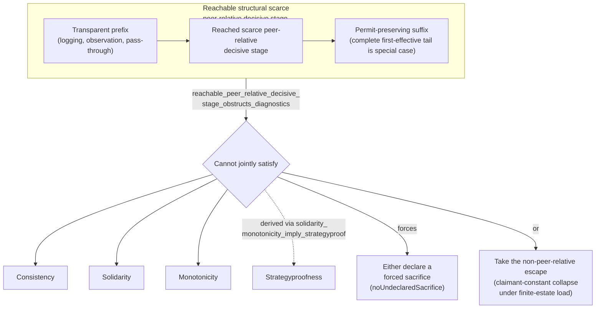

# Repository Context

This note preserves operational and background material that is useful for readers who want more context than the theorem-first README should carry.

## Kernel Shape

The runtime kernel checks five obligations:

- CERTIFIABLE: governed outcomes carry checkable certificates and proof witnesses.
- GOVERNANCE-OBSERVABLE: governance state and decisions remain auditable through extraction, ledger integrity, and runtime observation.
- CORRIGIBLE: supervisory interventions preserve the governance substrate while enabling authorized control.
- COMPOSITIONAL SAFETY: composed governance graphs remain legitimate under composition, cycles, and decomposition pressure.
- NON-VACUOUS: the system actually governs instead of collapsing into refusal, deadlock, or permanent escalation.

`IsSemanticLegitimacyKernel` strengthens this runtime kernel with graph diagnostics and spectral well-connectedness through `KernelSemanticBridge`. The decomposition theorem `semanticKernel_iff_runtime_diagnostic_spectral_layers` factors that target into runtime, diagnostic, and spectral layers; it does not derive graph diagnostics or spectral structure from runtime obligations alone.

`GOVERNANCE-OBSERVABLE` is the current name for the observability axiom. It emphasizes governance-query preservation rather than raw-state identity exposure.

## Reference Docs

Start with [`lean-module-architecture.md`](lean-module-architecture.md). It is
the maintained subsystem ledger and graph-carrier map for reviews; it records
the top-level Lean subsystems, major Rust modules, LOC/file counts, key
declarations, authority classes, and the current carrier seams.

Other reference docs:

- [`claim-ledger.md`](claim-ledger.md): canonical evidence map for public claims
  in README and the papers.
- [`governance-decision-lattice.md`](governance-decision-lattice.md): canonical
  `Permit` / `Deny` / `Escalate` normalization for extractor lanes.
- [`degenerate-behavior.md`](degenerate-behavior.md): current empty and cyclic
  graph behavior across graph and kernel audit checks.
- [`pillar2-governance-audit-capacity-design.md`](pillar2-governance-audit-capacity-design.md):
  finite-channel audit capacity, independent legitimacy, and reportability
  boundary design.
- [`production-self-audit-loeb-design.md`](production-self-audit-loeb-design.md):
  production self-audit certificate and reflective Loeb construction design.
- [`rust-lean-governance-property-parity.md`](rust-lean-governance-property-parity.md):
  Rust `GovernanceProperty` to Lean protocol/audit/check parity map.
- [`extractor-ast-theorem-witness.md`](extractor-ast-theorem-witness.md):
  source AST hash, graph hash, and theorem-witness binding protocol.

## Theorem Spine Context

The README elevates the forcing theorem because it is the agent-governance load-bearer: any pipeline whose scarce peer-relative decisive structural allocator is reachable through a transparent prefix and followed by non-denying suffix discipline cannot keep all three governance diagnostics simultaneously. The shortened README keeps only the headline theorem and the directly consumed results. The full supporting theorem map below preserves the prior 17-statement compiler stack without making the root page ask the reader to choose the central result.

### S1 Carrier Seam

The public harness verdicts operate over
`AuditGovernanceGraph` (`lean/Legitimacy/Results/GovernanceAdmissibilityAudit/Core.lean:96`),
while the impossibility theorem operates over `GovernanceGraph`
(`lean/Legitimacy/Foundations/Graph.lean:57`) and related
`DecisionPipeline` predicates. The bridge from `GovernanceGraph` diagnostics to
the typeclass predicate surface is proven by `graphConsistency_eq_graphConsistencyP`,
but a faithful `GovernanceGraph` <-> `AuditGovernanceGraph` carrier bridge is
not proved in the current tree. The current `liftGovernanceGraphToAuditGraph`
helpers are lossy, and the boundary is documented by no-bridge theorems in
`lean/Legitimacy/Reflective/PeerRelativeAuditOrthogonality.lean`, including
`no_universal_audit_passes_to_graph_diagnostics_bridge`
(`lean/Legitimacy/Reflective/PeerRelativeAuditOrthogonality.lean:211`) and
`no_finite_corpus_pass_implies_all_profile_consistency_without_representation`
(`lean/Legitimacy/Reflective/PeerRelativeAuditOrthogonality.lean:141`).
See
[`lean-module-architecture.md`](lean-module-architecture.md#canonical-graph-carriers)
for the full carrier map.

### Headline Theorem

`reachable_peer_relative_decisive_stage_obstructs_diagnostics`
(`lean/Legitimacy/Impossibility/PeerRelativeReachable.lean:103`) is the forcing move. It states that a governance pipeline with a reachable scarce peer-relative decisive stage, reached through a transparent prefix and followed by the required suffix discipline, cannot jointly satisfy graph consistency, graph solidarity, and graph monotonicity. The theorem is deliberately stated at the reachable-stage level; the older complete first-effective peer-relative surface is retained as a special case through `complete_first_effective_implies_reachable_peer_relative_decisive`. This is the source of the forced tradeoff that the rest of the stack makes operational.

### Supporting Theorems

#### 1. Impossibility / Forced Sacrifice

`Safety.noUndeclaredSacrifice`
(`lean/Legitimacy/Safety/KernelSafety/BinaryDecisionPipeline.lean:132`) turns the obstruction into a live activation condition. For a complete peer-relative surface, live compilation is equivalent to live compilation with the forced peer-relative sacrifices declared. It connects the mathematical obstruction to the protocol state machine: the problem is not that a peer-relative surface can never be used, but that its forced consistency and monotonicity sacrifices cannot remain hidden.

`no_universal_repair_preserves_strict_decision_preservation`
(`lean/Legitimacy/CaseStudies/UniversalRepair.lean:974`) gives the negative side of the repair boundary. A universal repair function cannot both close every detected diagnostic failure and preserve strict decision behavior. This prevents the public story from implying that the forced sacrifice can be patched away while leaving the original governance behavior unchanged.

`nonCollapsedReplacementRepair_universal_under_nontrivial_faithfulness`
(`lean/Legitimacy/CaseStudies/UniversalRepair.lean:988`) gives the matching positive side. Universal replacement repair exists at the weaker non-collapsed faithfulness level. Together with the strict-preservation impossibility, it makes repair scope explicit: replacement can produce a nontrivial satisfying graph, but exact behavior preservation is too strong.

#### 2. Capability Scaling Phase Transition

`C_star_exists`
(`lean/Legitimacy/Spectral/Capacity/CriticalCapability.lean:55`) is the local phase-transition theorem. Under positive spectral CV and positive tolerance, the reciprocal threshold `C_star G s δ` separates subcritical capability scales from scales at or above which the spectral violation predicate fires. This theorem supplies the concrete capability threshold later shared by the compression theorem.

`stackelberg_convergence_limit_iff_zero_consistency_vulnerability`
(`lean/Legitimacy/Spectral/Dynamics/StackelbergConvergence.lean:188`) is the asymptotic spectral limit. In the current spectral surrogate, mechanisms have arbitrarily large spectral stable equilibria exactly when their consistency vulnerability is zero (`G.cv s = 0`). It is the unbounded-capability counterpart to `C_star_exists`: positive CV yields a finite cliff; zero CV is the spectral escape condition.

`ASIBridge.uniK_n_asiSpectralSignature_depth3`
(`lean/Legitimacy/Spectral/ASIBridge/FamilyAlignment.lean:232`) supplies parameterized scaling-pressure structure for the complete native carrier family. Given positive tolerance and positive depth-3 critical CV, the complete native carrier has the depth-3 spectral signature. This keeps the scaling-pressure layer family-indexed rather than tied only to isolated n=5/n=7/n=9 examples.

`ASIBridge.asiSpectralSignature_uniK_n_iff_positive_depth3_cv`
(`lean/Legitimacy/Spectral/ASIBridge/FamilyAlignment.lean:241`) sharpens the previous theorem into an iff. The depth-3 spectral signature for the parameterized complete carrier exists exactly when tolerance and the computed depth-3 critical CV are positive. The result is structural and spectral; it is not a behavioral alignment theorem.

`CapabilityScalingKernelSafety.capability_scaling_shared_cliff`
(`lean/Legitimacy/Results/CapabilityScalingKernelSafety.lean:639`) is the compression theorem. One complete peer-relative surface in a shared substrate yields the diagnostic obstruction, positive claimant-interaction CV, a shared `C_star` cliff, capacity-certificate consequences, live-protocol reachability, and the activation declaration gate. The substrate type is inhabited by `CapabilityScalingKernelSafety.exampleCapabilityScalingSubstrate` (`lean/Legitimacy/Results/CapabilityScalingKernelSafety.lean:597`), so the compression theorem ranges over a populated domain. The theorem is intentionally later than the phase-transition and safety results because it consumes them. The supporting theorem `avoids_cliff_iff_zero_consistency_vulnerability` remains important, but the public spine uses the compression theorem as the unified statement.

#### 3. Verification Capacity Transmission

`GovernanceChannel.channel_capacity_bounds_C_star`
(`lean/Legitimacy/Spectral/Channels/CStarChannelBridge.lean:551`) connects finite-channel verification capacity to the same critical capability threshold. Given a graph-calibrated capacity certificate, the Shannon channel-capacity value bounds `C_star`. This is the bridge that makes capacity a verifier-side constraint rather than a separate metaphor.

`governance_capacity_alignment_threshold`
(`lean/Legitimacy/Spectral/Capacity/CapacityConverse.lean:244`) is the target-saturating
capacity-converse endpoint. Under positive spectral vulnerability, positive
tolerance, `C_star G s δ ≤ protocol.target_capability`, coordinate saturation
at that target, and any positive log-rate lower bound for the message family,
every sufficiently large block contains a message whose deployment claim is
false. This is the `C_star` target-saturating converse; it is not the binary
one-decision-per-use rate converse by itself.

`bounded_extractor_contract_sound`
(`lean/Legitimacy/Extract/Soundness.lean:121`) states the Lean-side extraction contract. A bounded extractor satisfying source-evidence, runtime-kernel, and semantic-bridge obligations maps well-formed source packages to semantic kernels. It does not verify Rust execution or arbitrary parser correctness; instead, it fixes the exact proof obligation at the source-to-graph boundary used by the Rust evidence tier.

#### 4. Safety Trajectory Invariant

`Safety.kernelReachabilitySafety`
(`lean/Legitimacy/Safety/KernelSafety/ReachabilityStack.lean:125`) is the finite trajectory invariant. Along a `KernelGovernedTrajectory` from an invariant initial datum, the reached state either remains kernel-invariant or exposes an indexed monitored sacrifice certificate. This is the dynamic companion to `Safety.noUndeclaredSacrifice`: activation cannot hide forced sacrifices, and governed reachability cannot silently lose the invariant.

`Safety.stateful_agent_schedule_safety`
(`lean/Legitimacy/Safety/KernelSafety/StatefulScheduleSafety.lean:179`) generalizes that shape to covered stateful schedules. Each realized action before the queried horizon must be classified as kernel-governed or certificate-emitting; under that coverage hypothesis, the same invariant-or-certificate conclusion holds. Intervention-aware, nondeterministic, and fair-prefix variants are supporting schedule theorems.

`CompiledGovernance.ClaimDecomposition`
(`lean/Legitimacy/Protocol/CompiledStepPolicy.lean:80`) supplies the narrower
compiled claim-policy seam: ordered claims are appended, singleton permits and
composed denials are both decided by the same `compiled.graph`, and the
peer-graph fixtures exhibit both benign and local-permit/composed-deny profiles.
This is not yet a kernel-action trajectory. The next binding must map one exact
nonempty `KernelStep.action_trace` to claims in order and separately prove, or
explicitly assume, the replay simulation law.

A `MonitoredSacrificeCertificate` records a target-invariant-carrying
`KernelStep` and a fired monitoring obligation, but it does not contain a
`KernelAxiomViolation`. Consequently
`compiledClaimAttack_monitorRetag_ofMonitorEvidence` is a conditional monitor
retag: it cannot establish kernel-axiom failure, action/claim causality, or
detection completeness.

#### 5. Protocol Activation Gate

`ConstitutionalAIBehavioralLineage.constitutionalAI_zero_consistency_vulnerability_implies_game_strategyproof`
(`lean/Legitimacy/Behavioral/ConstitutionalAILineage.lean:803`) is a narrow deployment-side lineage bridge. For the constructed Constitutional-AI-trained audit subject, zero consistency vulnerability transports to game strategyproofness through the formal spectral/behavioral embedding. This is not a full embedding of Anthropic Constitutional AI; it is the scoped proof that the deployment policy surface can participate in the same zero-CV spectral discipline.

`codexHarness_stage4_threshold_removed_derives_finite_audit`
(`lean/Legitimacy/CaseStudies/CodexHarness.lean:680`) is the concrete harness activation endpoint. Stage-2 threshold removal gives zero CV on the derived repaired carrier, zero CV gives a zero repaired threshold signal, the zero signal derives monotonicity and nonvacuity passes, and the named per-check statuses compose to the production admissibility verdict. The supporting theorem `codexHarness_repaired_spectral_zero_derives_monotonicity_pass` remains load-bearing inside the case study, while the public spine keeps the final finite-audit derivation.

## Current Boundary Design Notes

Two current design notes document recent boundary work:

- [`production-self-audit-loeb-design.md`](production-self-audit-loeb-design.md)
  explains the production self-audit box as a faithful Loeb-constructed
  re-presentation of the `native_decide` audit certificate. The certificate is
  the discriminating content; the modal conjunct is non-vacuous but not consumed
  by exported verdict results.
- [`pillar2-governance-audit-capacity-design.md`](pillar2-governance-audit-capacity-design.md)
  explains why finite Shannon capacity, independent audit legitimacy, and
  reportability remain separate unless a representation map is supplied.

The corresponding Lean modules are:

- `lean/Legitimacy/Reflective/ProductionSelfAudit.lean`: subject-relative
  production self-audit formula, Prop-level certificate, local modal proof
  predicate, and exported box/certificate equivalence over the production audit
  fixture.
- `lean/Legitimacy/Spectral/Channels/GovernanceAuditCapacity.lean`:
  finite-channel audit-capacity witness plus orthogonality results showing
  capacity achievement, independent legitimacy, and reportability do not imply
  one another without an additional bridge.
- `lean/Legitimacy/Reflective/PeerRelativeAuditOrthogonality.lean`: proven
  no-bridge and boundary-map results showing a production audit certificate or
  passing audit statuses do not identify the `GovernanceGraph` diagnostics used
  by the peer-relative impossibility layer; capacity-style evidence remains
  orthogonal to admissibility-style evidence.

## README Absorbed Context

This section preserves background material moved out of the root README so the README can stay theorem-first while the information remains public and linkable. Return to the short entry point at [README.md](../README.md).

### Bounded Extraction Contract

The formal guarantees in this repository govern the *extracted* `GovernanceGraph` model. Source-to-graph extraction through the Rust `src/extract/` pipeline and its tree-sitter parsers is heuristic and empirical, not formally verified.

Lean proves properties of modeled governance artifacts once the graph exists. It does not prove that arbitrary source syntax was faithfully converted into that graph. Extraction faithfulness is therefore part of the trusted base: byte-stable fixtures, parity tests, provenance records, and committed snapshots provide evidence for it, but it is not itself a theorem in the current tree.

Reviewers should treat this source-to-graph boundary as the unverified TCB. Attacks on extraction faithfulness, parser coverage, omitted control flow, or misleading source structure are attacks on the trusted base, not refutations of the Lean proofs over the resulting `GovernanceGraph`.

Most contemporary alignment work operates one layer below this. RLHF and reward modeling shape what the model wants. Constitutional prompting and process supervision shape how the model behaves. Scalable oversight builds verifier architectures around what the model outputs. Each treats the model as the object under control. Legitimacy treats the *rule* as the object — the typed governance artifact that allocates tool access, escalation, memory, and review. This artifact is a candidate verifier target inside the safety-spec layer of that broader program. It is not a replacement for behavioral evaluation. It is not a universal alignment theorem.

The central contribution is not a theorem in isolation. It is a legitimacy stack. The forcing move is an impossibility theorem: reachable scarce peer-relative decisive stages, under transparent-prefix and non-denying-suffix discipline, cannot jointly satisfy consistency, solidarity, and monotonicity. Rust extracts and audits real governance surfaces. The protocol blocks live activation of any rule whose forced sacrifices are undeclared. Lean proves the modeled theorem, kernel, safety-trajectory, spectral, and bounded-extraction layers. For safety work, this creates a concrete target: no silent degradation of governance claims. A kernel-governed trajectory preserves its stated obligations or surfaces an indexed sacrifice certificate that explains what broke. The diagram traces a policy from rule to verdict.

### Why This Exists

A governance rule can execute and still fail as governance. A local improvement can make a peer worse off. A composed pipeline can reverse a denial. A policy can be live but unobservable. A system can silently degrade outside its claimed safety envelope. This repository treats those failures as first-class mathematical and operational objects.

### Core Contributions

The semantic legitimacy kernel is a product object, not a scalar. It bundles a five-axiom runtime kernel, three graph-diagnostic primitives plus one derived, and a spectral well-connectedness witness through an explicit bridge. That witness is a composite predicate combining spectral connectivity (a gap lower bound) with positive governance vulnerability (`cv > 0`, exposed by the spectral-CV threshold); the two are independent characteristics, and the composite is what semantic legitimacy requires. The kernel decomposition diagram in [`docs/repository-context.md`](repository-context.md) shows the layering precisely.

### Artifact

The repository contains three checked layers:

| Layer | Public surface |
| --- | --- |
| Rust extractor and CLI | `legitimacy extract`, `legitimacy audit-graph`, policy compilation, protocol-state commands |
| Bounded contract | `BoundedExtractorContract`, `bounded_extractor_contract_sound`, byte-stable fixture contracts, and the explicit extractor boundary |
| Lean theorem stack | impossibility theorem, capacity theorem, RG flow universality, scope-qualified observational corrigibility bridges, spectral universality packaging, `noUndeclaredSacrifice` and `kernelReachabilitySafety`, kernel deny-bottom suffix lemma; zero `sorry`/`admit`/first-party `axiom` hits under the verification gate |

Current Lean gate: `lake build` completes cleanly. The Rust gate includes byte-stable extraction snapshots, Rust/Lean concrete-value parity, protocol tests, and a 1000-line Rust source file cap.

The root Lean import `import Legitimacy` is the paper-facing theorem facade.
`StackelbergLineage` is root-covered through the behavioral composition surface,
with a focused Lake target retained for direct work on the concrete
node-removal behavioral realization. The `spectral_fixture_export` /
`asi_parity_fixture_export` executables materialize fixture bytes for parity
checks rather than re-exporting theorem names through the root module.
`RustHookCoreCodexHooksFixture` builds the
restricted Codex RustHookCore fixture module used to pin theorem-backed
extractor behavior without adding fixture names to the root facade.

### Claim Ledger

| Claim | Where to inspect | Boundary |
| --- | --- | --- |
| Peer-relative governance has a forced consistency / solidarity / monotonicity tradeoff (with strategyproofness derived). | `papers/03-impossibility-theorem.md`, `lean/Legitimacy/Foundations/StructuralPeerRelative.lean`, `lean/Legitimacy/Impossibility/PeerRelativeClass/Obstructions.lean:204`, `lean/Legitimacy/Results/Impossibility.lean` | Formalized over `[DecisionPipeline P]` for `NontrivialSymmetricScarcePeerRelativeBinaryAllocator`; the older aggregator predicate is derived as a compatibility lemma. Broad peer-relativity alone, peer-relativity plus finite estate without symmetry, and an upstream deny-all gate are all formal countermodel boundaries. |
| The forcing tradeoff has a quantitative scaling phase transition in the spectral surrogate: governance mechanisms retain spectral stable equilibria at unbounded capability iff `G.cv s = 0`, with a concrete critical-capability threshold past which positive-CV mechanisms fail the spectral no-violation inequality. | `lean/Legitimacy/Spectral/Dynamics/StackelbergConvergence.lean:188` (`stackelberg_convergence_limit_iff_zero_consistency_vulnerability` biconditional), `lean/Legitimacy/Spectral/Capacity/CriticalCapability.lean` (threshold `C_star = δ / cv(G,s)`) | Formalized in the spectral surrogate; capability `κ` enters multiplicatively. The result characterizes spectral-equilibrium persistence; it does not model behavioral cycling, capability allocation, learning dynamics, or adversarial scheduling beyond the Stackelberg-bounded layer. |
| Extracted governance graphs are audited by a canonical nine-element runtime surface (3 graph-diagnostic primitives + 1 derived + 5 kernel-axiom graph projections). | `src/extract/`, `src/axioms/`, `papers/03-impossibility-theorem.md:809`, `tests/extract.rs` | Executable Rust diagnostics; not a proof of arbitrary parser correctness. |
| `governanceAdmissibilityVerdict` distinguishes proved legitimacy, rejection, and undischarged skipped evidence. | `lean/Legitimacy/Results/GovernanceAdmissibilityAudit/Checks.lean`, `lean/Legitimacy/Results/GovernanceAdmissibilityAudit/Fixtures.lean` (`cyclicSkippedAuditGraph_undischarged`), `src/extract/audit.rs` | Cyclic graphs with skipped canonical checks cannot promote to theorem-facing legitimacy or Rust `can_extract_compile: true`; skipped checks are absent evidence, not passes. The field means extractor substrate eligibility, not live activation. |
| The public examples instantiate the diagnostic surface on real open-source agent harness graphs. | `examples/graphs/codex-graph.json`, `examples/graphs/claude-agent-sdk-graph.json`, `papers/01-what-the-compiler-found.md`, Lean finite-graph verdict theorems for Codex and Claude Agent SDK. | Public graph fixtures are reproducible diagnostic artifacts, not social rankings of the underlying projects. Broader provenance and process logs are useful for development but are not part of the primary public narrative. |
| Per-harness verdicts are diagnostic-specific finite-fixture claims, not frontier-framework refutations. Codex and Claude Agent SDK reject monotonicity on theorem-backed extracted fixtures; CrewAI rejects monotonicity on a disclosed test-source regression fixture; OpenClaw rejects nonvacuity while consistency, solidarity, monotonicity, and strategyproofness pass; AutoGen's singleton test-source fixture passes. The separate AI-Control fixtures receive `AuditVerdict.legitimate` under the current polarity-aware audit. | `lean/Legitimacy/Results/CodexAdmissibilityAudit.lean:209`, `ClaudeAgentSDKAdmissibilityAudit.lean:188,200`, `CrewAIAdmissibilityAudit.lean:32`, `OpenClawAdmissibilityAudit.lean:31`, `AutoGenAdmissibilityAudit.lean:50`, `Audits/AIControl.lean:650-683` | Canonical-lattice rejections survive only for the named rejected fixtures and diagnostics. They are extracted-graph or hand-modeled fixture verdicts with extractor/modeling boundaries, not social rankings, product safety claims, or AI-Control safety-case refutations. |
| Kernel obligations can be checked, skipped, failed, or certified explicitly; activation is blocked on undeclared forced sacrifices. | `src/axioms/kernel/`, `src/protocol/`, `tests/protocol.rs` (incl. `protocol_compile_rejects_peer_relative_surface_without_forced_sacrifices`), `lean/Legitimacy/Safety/KernelSafety/BinaryDecisionPipeline.lean:132` (`noUndeclaredSacrifice`) | Live-state activation rejects skipped kernel evidence; the Rust extractor's `can_extract_compile` field is a weaker substrate-extractability check that allows skipped projections in degenerate-but-non-cyclic graphs when at least one axiom passes and none rejects. |
| Rust and Lean concrete values stay synchronized at the canonical fixture boundary. | `tests/parity_concrete_values.rs`, `lean/Legitimacy/Extract/`, `EmpiricalParityCertificate` | Concrete-value and fixture parity; the byte-equality between Rust runs and Lean-modeled bytes is a named external hypothesis (`extractor_byte_stable_soundness_boundary`). |
| Kernel-governed trajectories and covered stateful schedules preserve stated obligations or surface monitored sacrifice certificates at the failing transition index. | `lean/Legitimacy/Safety/KernelSafety/ReachabilityStack.lean` (`kernelReachabilitySafety`), `lean/Legitimacy/Safety/KernelSafety/StatefulScheduleSafety.lean:179` (`stateful_agent_schedule_safety`), `Trajectory.lean`, `GovernanceExamples.lean:297,524` | Scoped to covered trajectories/schedules with explicit governance-or-certificate obligations; not a universal alignment theorem. |
| Scaling-pressure relevance is spectral and governance-structural, not a universal reliability proof. | `lean/Legitimacy/Spectral/CrossScale/ASIUniversality.lean`, `lean/Legitimacy/Results/ASIGovernanceReliability.lean`, `lean/Legitimacy/Spectral/Dynamics/StackelbergConvergence.lean`, `lean/Legitimacy/Spectral/Capacity/CriticalCapability.lean` | Current tree packages spectral universality, the Stackelberg capability-pressure limit in the spectral surrogate, the critical-capability phase transition, and scope-qualified corrigibility bridges. It does not prove universal alignment; a scoped kernel bridge, retaining the existing Lean `ASIBridge` naming, is proved for family-aligned complete carriers currently including uniK5, uniK7, and uniK9 with the spectral lift derived for each; n=7/n=9 size-indexed signature witnesses are discharged by `uniK7_asiSpectralSignature_depth3` and `uniK9_asiSpectralSignature_depth3`, and the carrier-specific bridge theorems are `uniK7_family_aligned_native_asi_signature_kernelInvariant` and `uniK9_family_aligned_native_asi_signature_kernelInvariant`; the substrate-wide free bridge remains open. A narrow Constitutional AI deployment-side audit-subject lineage is formalized through `ConstitutionalAITrainedAuditSubject`, `spectralBehavioralEmbedding`, and `constitutionalAI_zero_consistency_vulnerability_implies_game_strategyproof`; this is not a full Anthropic CAI embedding, and deliberative alignment remains outside that CAI embedding. A narrow typed AI Control protocol-role projection exists (`AIControlGovernanceGraph`, `MonitorCapacityLineage`, `declared_escalation_yields_monitored_sacrifice`); full behavioral/evaluation embedding of AI Control results remains future work. |

## Paradox Scope

The paradox suite is Rust-only by design in this release line. It is a
production diagnostic over concrete allocation rules and extracted governance
graphs, not a member of the canonical Lean axiom inventory.

`legitimacy paradox` and the leaderboard `Paradoxes` column report finite
witness searches such as claimant-addition loss, population loss, priority
inversion, the append-peer-review compositional-Alabama probe, feedback
monotonicity failure, and path dependence. These witnesses are operationally useful because they point to a
specific perturbation that a maintainer can inspect. They do not currently add a
separate formal obligation beyond the Lean-owned graph diagnostics and
runtime-kernel projections.

Accordingly, Lean contains no `AuditCheck.paradox`, no `Alabama` predicate, and
no paradox parity theorem. If paradoxes are later promoted from diagnostics to a
formal axiom family, that promotion must add Lean predicates and parity gates in
the same change.

## Review-Required Axiom Revision

The review-required lattice is a parallel Lean theorem surface, not a canonical
axiom promotion. The canonical nine-element inventory and leaderboard columns
stay unchanged. The revised lattice records a defensible alternate reading of
terminal `.escalate`: it is review-required and eventually
upgradeable, so monotonicity treats `.permit` and `.escalate` as the same
non-denial class. The paired nonvacuity revision treats terminal `.escalate` as
nonvacuous for the same reason.

This revision is intentionally reported side by side with the canonical
diagnostic. It produces a narrow result: AutoGen passes under both; Codex,
Claude Agent SDK, and CrewAI still reject revised monotonicity; OpenClaw still
rejects revised nonvacuity because its witness is all-deny rather than
unresolved escalation. The structural meaning is therefore choice-sensitive,
diagnostic-specific, and confined to the committed fixtures.

## Evidence Tiers

Extraction and audit outputs preserve their evidence tier:

- `extract --synthetic` runs a structural probe and labels the report `SyntheticStructuralProbe`.
- `audit-graph --claims ... --claims-provenance fixture|observed-runtime|reviewed-reconstruction` audits against an explicit corpus and records that provenance.
- `extract --review-overlay overlay.json` applies curated node and edge promotions plus alias hints on top of automatic extraction.

The committed public audit lanes are:

- Automatic synthetic-probe leaderboard rows for Codex, the Claude Agent SDK, OpenClaw, CrewAI, and AutoGen in `audits/leaderboard/`.
- Governance-corpus v1 heuristic rows for Aider, AutoGen, Claude Agent SDK Python, Cline, Codex, Continue.dev, CrewAI, DSPy agents, Guardrails AI, LangChain, LangGraph, Letta, LiteLLM proxy policy, LlamaIndex agents, NeMo Guardrails, OpenHands, Qwen-Agent, Roo Code, Semantic Kernel, and SWE-agent in `audits/corpus/`.
- An observed-runtime Codex TUI example in `audits/observed-runtime/`.
- A paper-extracted Sleeper Agents structural audit in `audits/sleeper-agents/`.
- Specification-level policy examples under `examples/`.

## Current Findings Snapshot

The committed leaderboard is generated by `scripts/refresh-leaderboard-audits.sh` and summarized in `audits/leaderboard/LEADERBOARD.md`.
CrewAI and AutoGen are disclosed test-source regression fixtures: CrewAI uses
`lib/crewai/tests/hooks/test_tool_hooks.py`, and AutoGen uses
`python/packages/autogen-agentchat/tests/test_code_executor_agent.py`. They are
not production-source coverage of `lib/crewai/src/crewai` or
`python/packages/autogen-agentchat/src/autogen_agentchat`. The provenance gate
`scripts/check-fixture-provenance.sh` fails unknown `/tests/` graph provenance
unless it is explicitly registered in
`audits/fixtures/sources/leaderboard/test-source-disclosures.txt`.
Single-node rows are also explicitly scoped: Aider, AutoGen, Continue.dev, and
LiteLLM proxy policy are 1-node / 0-edge minimal-shape smoke or regression
surfaces. They remain useful for extractor continuity, but they are not
multi-node governance coverage.
OpenClaw is Peter Steinberger's public open-source agent runtime at
`github.com/openclaw/openclaw`, licensed under MIT, and recorded here as a
widely-used open-source agent runtime. The local audit tooling runs on OpenClaw,
but the paper author did not write OpenClaw; the row should be read as a
third-party public peer audit target, not as closed-source internal evidence.

| System | Current automatic lane |
| --- | --- |
| Aider | v1 corpus pointer-pinned heuristic row; extractor report pending local source slice. |
| Codex | Connected hook graph; monotonicity and non-vacuity fail under the synthetic structural probe; append-peer-review compositional-Alabama probe detected. |
| Claude Agent SDK | Legacy name for the public Python SDK hook-protocol row. |
| Claude Agent SDK Python | Disconnected hook-protocol graph; monotonicity fails under the synthetic structural probe. |
| Cline | v1 corpus pointer-pinned heuristic row; extractor report pending local source slice. |
| Continue.dev | v1 corpus pointer-pinned heuristic row; extractor report pending local source slice. |
| OpenClaw | Connected governance graph; automatic extraction currently fails non-vacuity under the synthetic structural probe. |
| CrewAI | Partial-mode connected hook graph; monotonicity and non-vacuity fail; append-peer-review compositional-Alabama probe detected. |
| DSPy agents | v1 corpus pointer-pinned heuristic row; extractor report pending local source slice. |
| Guardrails AI | v1 corpus pointer-pinned heuristic row; extractor report pending local source slice. |
| LangChain | v1 corpus pointer-pinned heuristic row; extractor report pending local source slice. |
| LangGraph | v1 corpus pointer-pinned heuristic row; extractor report pending local source slice. |
| Letta | v1 corpus pointer-pinned heuristic row; extractor report pending local source slice. |
| LiteLLM proxy policy | v1 corpus pointer-pinned heuristic row; extractor report pending local source slice. |
| LlamaIndex agents | v1 corpus pointer-pinned heuristic row; extractor report pending local source slice. |
| NeMo Guardrails | v1 corpus pointer-pinned heuristic row; extractor report pending local source slice. |
| OpenHands | v1 corpus pointer-pinned heuristic row; extractor report pending local source slice. |
| Qwen-Agent | v1 corpus pointer-pinned heuristic row; extractor report pending local source slice. |
| Roo Code | v1 corpus pointer-pinned heuristic row; extractor report pending local source slice. |
| Semantic Kernel | v1 corpus pointer-pinned heuristic row; extractor report pending local source slice. |
| SWE-agent | v1 corpus pointer-pinned heuristic row; extractor report pending local source slice. |
| AutoGen | Current hardened extraction finds a single approval hook that passes the synthetic structural probe. |

The observed-runtime Codex TUI lane is intentionally separate from the synthetic leaderboard: it audits a filtered runtime-facing source slice against a redacted `oss-story` runtime corpus and preserves `observed-runtime` provenance.

The Sleeper Agents lane is also separate from the automatic source-code leaderboard: it is a manual paper-graph extraction from Hubinger et al. arXiv:2401.05566 and records a monotonicity rejection with solidarity and non-vacuity passing.

## Verification Boundary Diagram

The byte-stable hypothesis between empirical Rust runs and Lean-modeled bytes is named (`extractor_byte_stable_soundness_boundary`), not hidden.

## Cross-harness Audit Map

Each rejection is backed by a Lean `native_decide` theorem on the finite extracted graph. The boundary asymmetry between open-source and proprietary harnesses is explicit in the diagram.

## Pipeline Diagram

End-to-end data flow from a `.rule.toml` policy or source code to the formal kernel and protocol activation gate. Each step references the canonical entry point in the Rust extractor and the Lean theorem stack.

## Kernel Decomposition Diagram

The semantic legitimacy kernel (`IsSemanticLegitimacyKernel`) bundles three layers through an explicit bridge. The bridge is load-bearing: the runtime kernel layer alone does not entail the graph diagnostics or the spectral witness.

## Forcing-move Scope Diagram

The headline impossibility theorem applies to reachable structural scarce peer-relative decisive stages: nontrivial symmetric scarce peer-relative allocators that are actually reached through a transparent prefix and followed by suffix stages that preserve the allocator's permits. The older complete first-effective peer-relative aggregator surface remains the special case where the reachable decisive stage is the first effective surface and the tail is complete.

## Repository Layout

| Path | What |
| --- | --- |
| `src/`, `cli/` | Rust crate: extractor, compiler, paradox suite, CLI |
| `lean/Legitimacy/` | Lean 4 / Mathlib formalization |
| `tests/` | Rust integration and regression tests |
| `examples/` | Typed TOML policy specifications |
| `audits/leaderboard/` | Per-system extraction transcripts and graph snapshots |
| `audits/observed-runtime/` | Explicit-corpus runtime audit artifacts |
| `papers/` | Manuscripts and public research writings |
| `ARCHITECTURE.md` | Implementation structure |
| `CONTRIBUTING.md` | Contribution guide |
